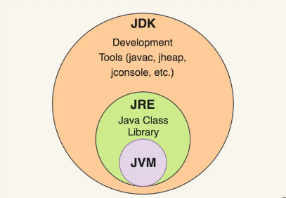

# Java RoadMap

## Programação Orientada a Objetos

- Um objeto (também chamado de instância) representa qualquer entidade no mundo real (Carro, Pessoa, Bicicleta, ATM, etc.);
- Uma instância possui comportamento e propriedades, definimos o compotamento de uma instância pelos métodos (funções que uma instância possui);

|               Programação Procedural               |                                  POO                                 |
|:--------------------------------------------------:|:--------------------------------------------------------------------:|
| Programa dividido em funções  de forma sequencial. | Programa divido em objetos.                                          |
| Não garante o encapsulamento dos dados.            | Garante o encapsulamento dos dados se for de necessidade do usuário. |
| Sobrecarga não é possível.                         | Sobrecarga é possível.                                               |
| Herança não é possível.                            | Herança é possível.                                                  |
| Reutilização de código não é presente.             | Reutilização de código é presente.                                   |
| Exemplos: Pascal, C, FORTRAN, etc.                 | Exemplos: Java, C#, Python, C++, etc.                                |

- Objetos possuem 2 características:
  - Propriedades ou estados;
  - Comportamento ou métodos.

- Exemplos:
  - Cachorro é um objeto por que:
    - Propriedades: Idade, cor, peso, etc;
    - Comportamento: Latir, comer, dormir, etc.

- As classes são modelos para criação de objetos, ou seja, a partir de uma classe X podemos criar várias instâncias de X. Vamos supor que você esteja responsável por confeitar um bolo e precisa ser estrelas de chocolate ao redor, o molde que você vai usar para fazer é a nossa Classe, enquanto as estrelas que serão formadas por você são os objetos;

- Uma classe possui a seguinte característica:


- ```age```, ```address``` e ```name``` representam as propriedades do estudante, enquanto ```study()``` e ```eat()``` representam os métodos, ou comportamentos, do estudante.

## 4 Pilares da Orientação a Objetos

### Abstração

Abstração significa "esconder" partes da implementação do objeto expondo apenas uma interface simples para seu uso.

Da mesma forma seu objeto deve ter uma interface simples e amigável, deixando suas partes complexas ou detalhes de implementação protegidos do mundo exterior. Assim mudanças feitas internamente no nível da implementação não irão afetar sua interface pública e aqueles que utilizarem o objeto.

### Encapsulamento

Encapsulamento se refere à construção do objeto de modo a proteger o acesso direto a seus dados internos. Ao encapsularmos um objeto estamos agrupando propriedades e métodos que estão diretamente relacionados dentro de um mesmo objeto, permitindo que essas propriedades sejam acessadas apenas através de métodos públicos. Desta forma tratamos de questões importantes como segurança e confiabilidade do estado do objeto.

### Herança

A Herança é uma forma de eliminar repetição de código onde, como o próprio nome sugere, um objeto pode herdar características (ou seja, propriedades e métodos) de outra classe, sem a necessidade de se reescrever essas mesmas características.

### Polimorfismo

Poli significa muitas e Morphos significa forma, então Polimorfismo significa muitas formas. Em POO Polimorfismo é caracterizado quando duas ou mais classes possuem métodos com o mesmo nome, mas podendo ter implementações diferentes. Assim, é possível utilizar qualquer objeto que implemente o mesmo método sem nos preocuparmos com o tipo do objeto. Na prática isso nos possibilita remover do nosso código diversos if statements ou switch cases.

No exemplo dado acima, utilizando polimorfismo podemos implementar o método calcular_ferias em cada um dos objetos clt e estagiario, sendo que cada um desses métodos pode ter uma implementação diferente.

## O que é Java?

- Plataforma independente de linguagem;
- Linguagem orientada a objetos (Abstração, Encapsulamento, Herança e Polimorfismo);
- Portabilidade: WORA (Write Once, Run Anywhere | Escreva uma vez, rode onde quiser);
- Três principais componentes do Java: JVM, JRE, JDK:



### JVM

- Java Virtual Machine:
  - Máquina Abstrata: "Abstrata" significa que ela não existe fisicamente;
  - ```Programa em Java``` = ```compilador``` => ```Byte Code``` = ```JVM``` => ```Código de Máquina``` = ```CPU``` => ```Saída```;
  - Acima está o processo de transformação do programa Java em código de máquina, a JVM é importante nesse processo pois ela garante a portabilidade da linguagem, pode rodar em qualquer lugar;
  - Por que? Quando o código Java é compilado, não obtemos o código de máquina diretamente, o que podemos é o ByteCode, este ByteCode pode ser executado pela JVM e assim obtems o código de máquina;
  - Então a JVM é uma plataforma dependente. Por que? Pois se temos um MAC OS, temos uma JVM do MAC OS, se temos um Linux, temos JVM do Linux e se temos um Windows, nós temos a JVM do Windows. Java é independente pois, se usarmos os exemplos anteriores, não existe um Java para cada tipo de Sistema Operacional, o Java é único e independente de Sistema Operacional ou qualquer outro tipo de plataforma;
  - O ByteCode é a entrada para JVM;
  - A JVM possui JIT Compiler (Just in Time Compiler), ou seja, em vez do compilador compilar todo o programa de uma só vez, ele compila somente as partes necessárias durante a execução do programa;
  - Mas como isso ajuda na portabilidade do Java? Com um ByteCode em mãos, conseguimos pegar qualquer JVM e executar esse ByteCode, ou seja, um ByteCode produzido no Android pode ser executado por qualquer JVM, seja em outro dispositivo móvel, computador, ou seja, qualquer JVM;

### Como compilar um arquivo Java?

```shell
java FileName.java
```

- Ao executarmos o comando acima, obtemos um arquivo chamado ```FileName.class```, que é o ByteCode.

### JRE

- Java Runtime Environment;
- O Java Runtime Environment ou JRE, é uma camada de software que é executada sobre um software de sistema operacional de um computador e fornece as bibliotecas de classe e outros recursos que um programa Java específico precisa executar.
- A JRE possui duas coisas: sua JVM e sua biblioteca de classes;
- No ByteCode podemos estar usando algumas bibliotecas de classe, então, a JVM precisa das bibliotecas;
- Nesse caso, se a gente tiver somente a JRE, podemos executar qualquer programa em Java, mas não podemos codificá-lo corretamente;
- A JVM faz parte da JRE.

### JDK

- Java Development Kit;
- NA JDK temos a linguagem de programação;
- NA JDK temos toda a informação sobre a linguagem de programação, compilador (javac), debugger;
- JDK = JRE + (Linguagem + compilador + debugger).
