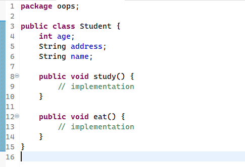

# Java RoadMap

## Programação Orientada a Objetos

- Um objeto (também chamado de instância) representa qualquer entidade no mundo real (Carro, Pessoa, Bicicleta, ATM, etc.);
- Uma instância possui comportamento e propriedades, definimos o compotamento de uma instância pelos métodos (funções que uma instância possui);

|               Programação Procedural               |                                  POO                                 |
|:--------------------------------------------------:|:--------------------------------------------------------------------:|
| Programa dividido em funções  de forma sequencial. | Programa divido em objetos.                                          |
| Não garante o encapsulamento dos dados.            | Garante o encapsulamento dos dados se for de necessidade do usuário. |
| Sobrecarga não é possível.                         | Sobrecarga é possível.                                               |
| Herança não é possível.                            | Herança é possível.                                                  |
| Reutilização de código não é presente.             | Reutilização de código é presente.                                   |
| Exemplos: Pascal, C, FORTRAN, etc.                 | Exemplos: Java, C#, Python, C++, etc.                                |

- Objetos possuem 2 características:
  - Propriedades ou estados;
  - Comportamento ou métodos.

- Exemplos:
  - Cachorro é um objeto por que:
    - Propriedades: Idade, cor, peso, etc;
    - Comportamento: Latir, comer, dormir, etc.

- As classes são modelos para criação de objetos, ou seja, a partir de uma classe X podemos criar várias instâncias de X. Vamos supor que você esteja responsável por confeitar um bolo e precisa ser estrelas de chocolate ao redor, o molde que você vai usar para fazer é a nossa Classe, enquanto as estrelas que serão formadas por você são os objetos;

- Uma classe possui a seguinte característica:



- ```age```, ```address``` e ```name``` representam as propriedades do estudante, enquanto ```study()``` e ```eat()``` representam os métodos, ou comportamentos, do estudante.
